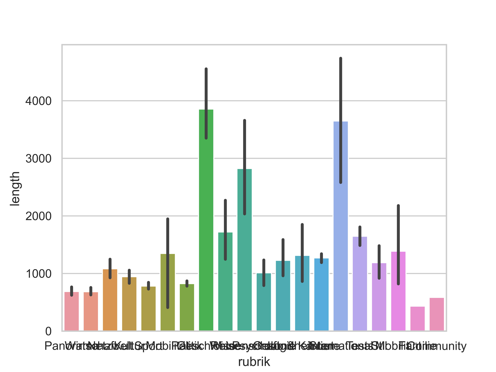
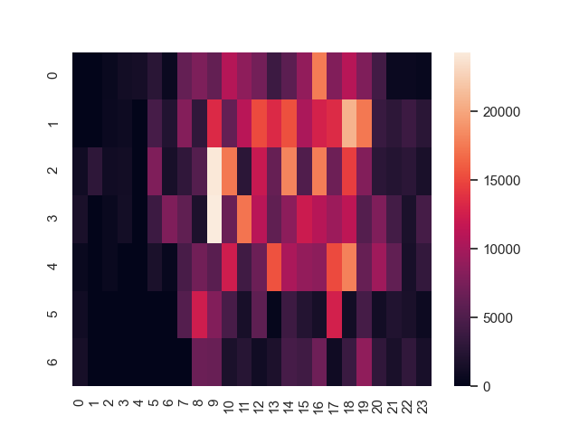
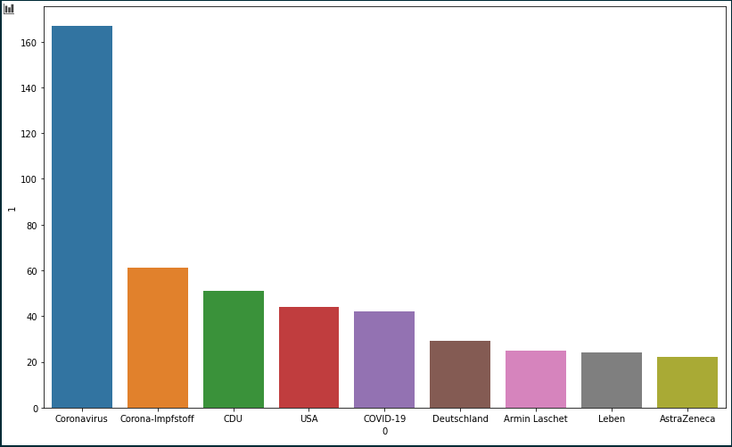

# spiegel-mining
Data mining pipeline to get information about the news site spiegel.de

#### Running the main.py file will download all the articles i have collected up to date! There are about 4000 of them! Make sure you want this!

### Miner
This script automatically fetches the newest articles, and saves in json format. Then it downloads those that were not already saved.

### Wrangler
This script extracts key features from the articles and saves them in .csv

### Vizier
This automagically creates images visualizing the data. The jupyter notebook is for data exploration.

### Some images

Barplot: Rubrik vs length of the article( chars not words )

Heatmap: Time of the day vs length of articles published

Barplot: keyword vs occurences

Network: keywords as nodes, with paired keywords as edges, the weight is determined by the frequency of the pairing
##### I would recommend looking at this in the .html file in the vizier folder. It loads an interactive graph

